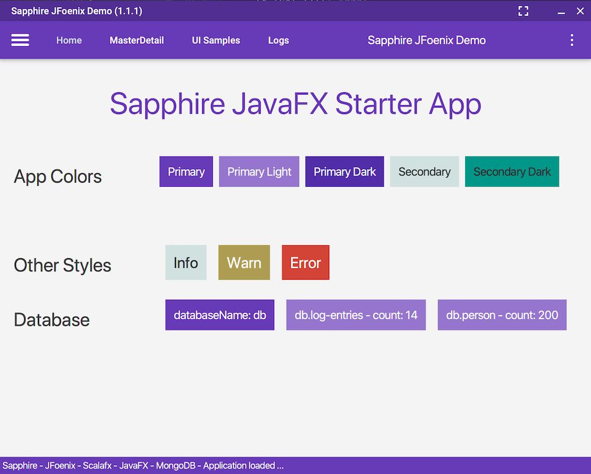
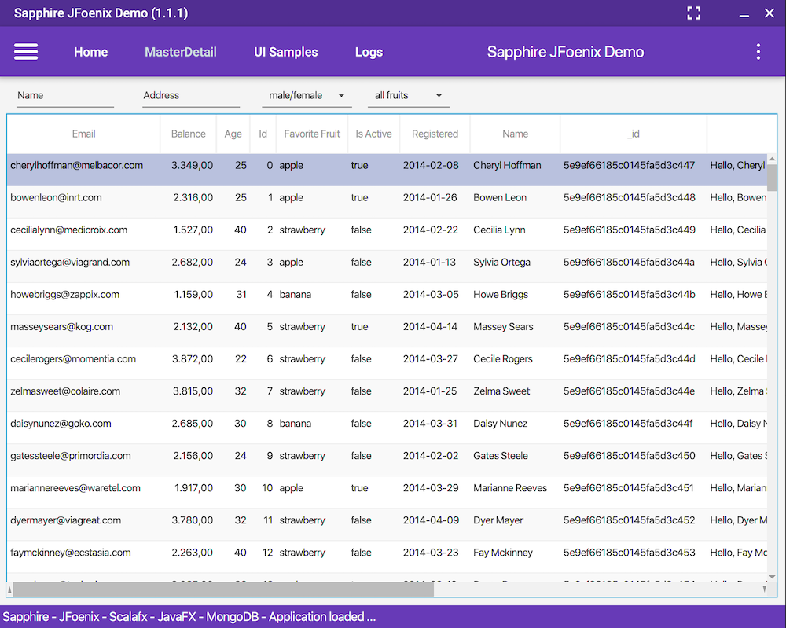
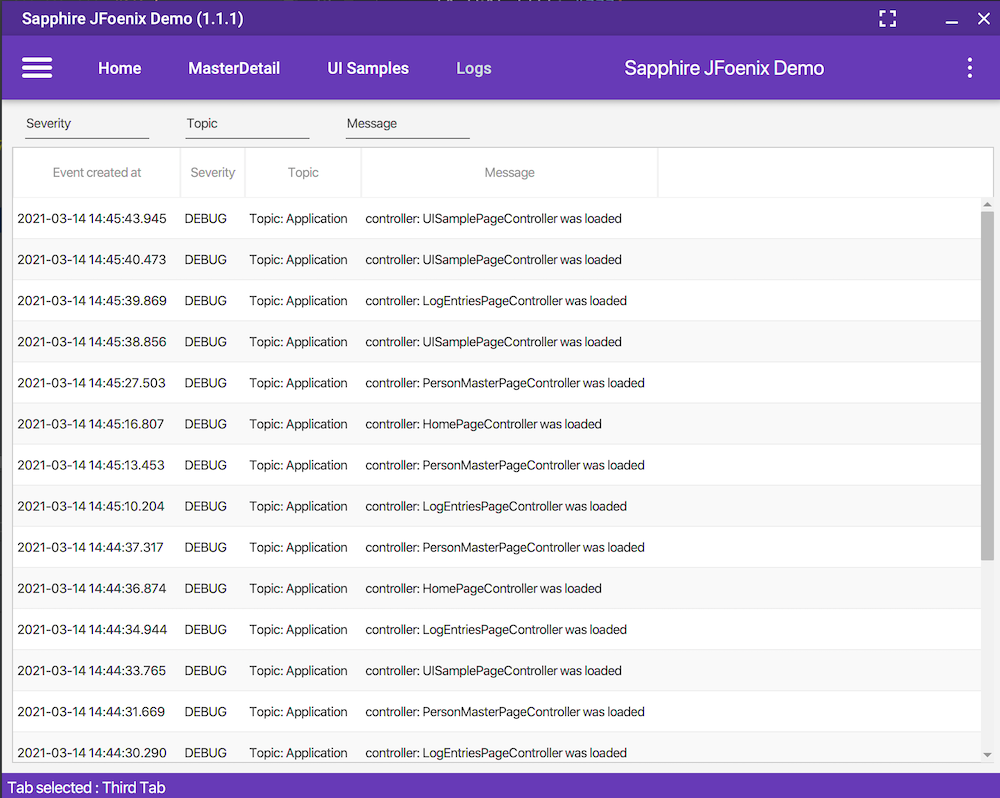

# sapphire-jfoenix-demo

JFoenix  Starter App build with [sapphire-javafx](https://sfxcode.github.io/sapphire-javafx).

## Features
* MVC Patttern
* Layout, Pages, Components, Widgets
* JFoenix UI Components and Sass Styling
* FXML Pattern (Table, Bindings, Expressions)
* (Local) MongoDB Database featured by [simple-mongo](https://sfxcode.github.io/simple-mongo)
* CRUD Sample

## Images






## Run Local

```shell script
  sbt run
````

## Build Application

Example code to package on Mac.

### Preconditions

* Copy dependent libs in folder (here: **dist**)
* Copy packaged jar to tehe same folder
* ensure module path of your jvm (here: path to adopt@1.15.0-1 modules)
* ensure modules are available in your jvm jmods directory ([javafx modules](https://gluonhq.com/products/javafx/))
* create a destination folder (here: out)
* use system specific type (here: dmg)

### Excecute Shell script

```
~/Library/Caches/Coursier/jvm/adopt@1.15.0-1/Contents/Home/bin/jpackage \
  --type dmg \
  --verbose \
  --input dist \
  --dest out \
  --name jfoenix-demo \
  --main-jar sapphire-jfoenix-demo_2.13-2.0.2.jar \
  --main-class com.sfxcode.sapphire.jfoenix.demo.Application \
  --module-path ~/Library/Caches/Coursier/jvm/adopt@1.15.0-1/Contents/Home/jmods \
  --add-modules java.base,javafx.controls,javafx.graphics,javafx.media,java.datatransfer,java.desktop,java.scripting,java.xml,jdk.jsobject,jdk.unsupported,jdk.unsupported.desktop,jdk.xml.dom,javafx.fxml,java.naming,java.sql,jdk.charsets \
  --mac-package-name jfoenix-demo \
  --mac-package-identifier com.sfxcode.sapphire.jfoenix.demo.Application \
  --java-options -Xmx2048m

```


